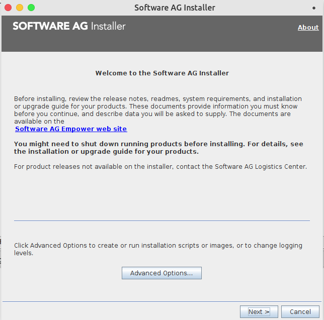
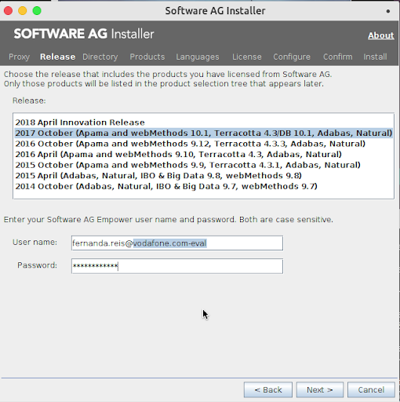
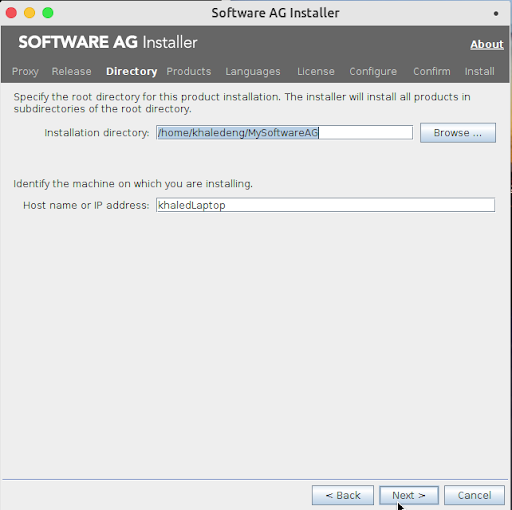
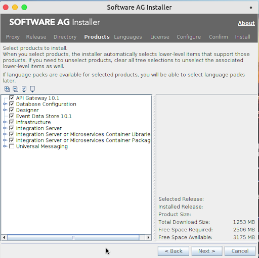
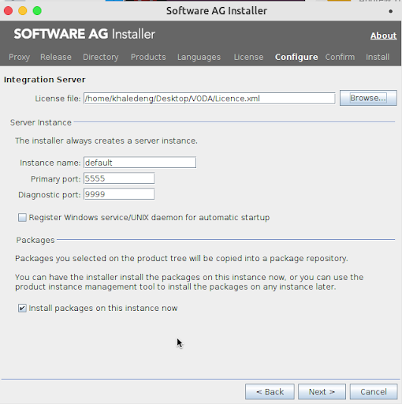

# Installing WebMethods API Gateway on PKS from scratch

## Prerequisites
This recipe assumes you have the following ready and available:

* A working PKS cluster, with *at least one* of the following (See [Why `vm.max_map_count`](#why-vmmax_map_count) for details):
    * The ability to run privileged containers
    * `vm.max_map_count` set to at least 262144 for all nodes and pods.
* A Windows or Linux machine - you *cannot* install the API Gateway on macOS
* A valid licence for the API Gateway version you're intending to install
* The Software AG installer JAR file
* A valid username and password to use in the installer (see next section)

## Recommendations
It is recommended that you use API Gateway 10.3 or later, if possible, as it has better support for K8s,
and there are enough differences in the docker images between 10.1 and 10.3 to make a migration painful.

10.2 is a "preview" release, and is not supported for production.

Prior to 10.1, the API Gateway was two separate components - Mediator, and Enterprise Gateway. This recipe
is not applicable to those components.

## Installing the API Gateway
**Note**: This section may be obsolete starting from API GW 10.3 - if Software AG provide pre-built,
production-ready docker images, proceed to [Creating a deployment descriptor](#creating-a-deployment-descriptor).

1. Start the installer with `java -jar SoftwareAGInstaller*.jar`
1. You will see the following screen:  
    
  Click `Next >`  
1. You will see the following screen:  
    
  Choose the version you want to install (e.g. "2017 October (Apama and WebMethods 10.1) ...")  
  Enter in a valid username and password, and click `Next >`.  
1. You will see the following screen:  
    
  Enter the directory you would like the files to be saved to - e.g., a folder in your home directory.  
  This directory will be used in later steps, and will be referred to as `$SAG_DIR`.  
  Click `Next >`
1. You will see the following screen:
    
  Make sure that the `API Gateway <version>` box is checked - if you do not see it, then you are likely
  trying to install it on an unsupported platform (e.g., macOS). You may be required to install other
  software as well - that is not an issue, as long as the `API Gateway <version>` box remains checked.
  Click `Next >`
1. You will see the following screen:  
    
  You will need to click `Browse` and navigate to a valid licence for the API Gateway version you are
  using. Note that this will be an XML file.  
  If `Register Windows service/UNIX daemon for automatic startup` is check, uncheck it.  
  Leave all the other settings as their defaults.  
  Click `Next >`
1. Click `Next >` for all subsequent screens, until it starts installing the software.

Once the installer is finished, it is necessary to build a Docker image from the installed API GW.

## Building the base Docker image
1. Navigate to `$SAG_DIR/IntegrationServer/docker/`
1. Run `./is_container.sh createDockerFile`
1. Run `./is_container.sh build`
1. Run `./apigw_container.sh createDockerFile`
1. Run `./apigw_container.sh build`

This will create two images, `is:micro`, and `is:apigw`, respectively the Integration Server and the
API Gateway. For the purposes of this recipe, only the latter is relevant (although it does extend off
the former).

**Note**: these images include the licence file, so it is not necessary to create your own Dockerfile
to add it in. 

## Creating a deployment descriptor
Once the docker image has been created, it is necessary to create a deployment descriptor to tell PKS
how to run it. This is an example:

```yml
apiVersion: apps/v1beta1
kind: Deployment
metadata:
  name: api-gateway-deployment
  labels:
    app: api-gateway-template
spec:
  replicas: 1
  selector:
    matchLabels:
      app: api-gateway-template
  template:
    metadata:
      labels:
        app: api-gateway-template
    spec:
      containers:
      - name: api-gateway-container
        image: is:apigw
        ports:
        - containerPort: 9072
        - containerPort: 5555
        readinessProbe:
          exec:
            command:
            - grep
            - "Initialization completed in"
            - /sag/IntegrationServer/instances/default/logs/server.log
          # Try every 5 seconds for 300 seconds
          periodSeconds: 5
          failureThreshold: 60
        livenessProbe:
          tcpSocket:
            port: 9072
          initialDelaySeconds: 300
          periodSeconds: 5
          timeoutSeconds: 10
```

This assumes that `vm.max_map_count` has been set cluster-wide, and it is not necessary to override it
specifically for this pod.

### Why `vm.max_map_count`
Why do we need to set this particular value? Because the API Gateway *requires* Elastic Search, and, if
an external ES node is not provided, will boot up an embedded one - which will fail, if 
`vm.max_map_count` is not set to an appropriate value - see 
[the ElasticSearch documentation](https://www.elastic.co/guide/en/elasticsearch/reference/current/vm-max-map-count.html) 
for more detail.

## Externalising Elastic Search
So far, this recipe has created a single API Gateway replica with an embedded Elastic Search. This is
fine for a demo, but as it has no persistence whatsoever, it is terrible for a production system.

The recommendation from SoftwareAG is to externalise Elastic Search. Creating and maintaining an ES
cluster is well beyond the scope of this recipe, so it assumes you have already done that, and have
an Elastic Search node (or cluster) available from PKS.

Given that, you will need to create a custom Dockerfile, like so:

**10.1**:
```docker
FROM is:apigw

COPY uiconfiguration.properties /sag/profiles/IS_default/apigateway/config/uiconfiguration.properties
COPY gateway-es-store.xml /sag/IntegrationServer/instances/default/packages/WmAPIGateway/config/resources/beans/gateway-es-store.xml
COPY config.properties /sag/IntegrationServer/instances/default/packages/WmAPIGateway/config/resources/elasticsearch/config.properties

RUN echo "" > /sag/profiles/IS_default/bin/apigw_UpdateNode.sh
```

TODO: Add all the files

**10.2+**:
```docker
FROM is:apigw

USER sagadmin

COPY uiconfiguration.properties /opt/softwareag/profiles/IS_default/apigateway/config/uiconfiguration.properties
COPY gateway-es-store.xml /opt/softwareag/IntegrationServer/instances/default/packages/WmAPIGateway/config/resources/beans/gateway-es-store.xml
COPY config.properties /opt/softwareag/IntegrationServer/instances/default/packages/WmAPIGateway/config/resources/elasticsearch/config.properties

RUN  chown -R sagadmin:sagadmin /opt/softwareag/IntegrationServer/instances/default/packages/WmAPIGateway/config/resources/elasticsearch/config.properties 
RUN  chown -R sagadmin:sagadmin /opt/softwareag/profiles/IS_default/apigateway/config/uiconfiguration.properties 
RUN  chown -R sagadmin:sagadmin /opt/softwareag/IntegrationServer/instances/default/packages/WmAPIGateway/config/resources/beans/gateway-es-store.xml 

RUN echo "" > /opt/softwareag/profiles/IS_default/bin/apigw_updateNode.sh
```

TODO: Add all the files

The reason for the two different Dockerfiles is that the structure and directory layout of the image
changed between 10.1 and 10.2.

Once a new docker image has been built and deployed to PKS, the API Gateway will now store the API
definitions and policies in the external Elastic Search, preventing data loss when the API GW restarts.

It also means that multiple replicas can be added and they will all share the same definitions - 
*however*, they do not share sessions, so exposing the API GW will result in a user having to log in
once per replica. See [Enabling Session Replication](#enabling-session-replication) for the steps to
fix this.

## Enabling Session Replication
The API Gateway uses Terracotta Server for handling session replication (another Software AG product) - to
deploy Terracotta, please see the recipe for [Installing Terracotta to PKS (MIA!)]().

Note that the API Gateway only works with _very_ specific versions of Terracotta - it is necessary to check
the "Compatibility Matrix" provided by SoftwareAG to figure out exactly which version works with the API
Gateway version that you are using. For 10.3, for example, this is Terracotta Server 4.5.3.

```
TODO: config changes to enable Terracotta
```
