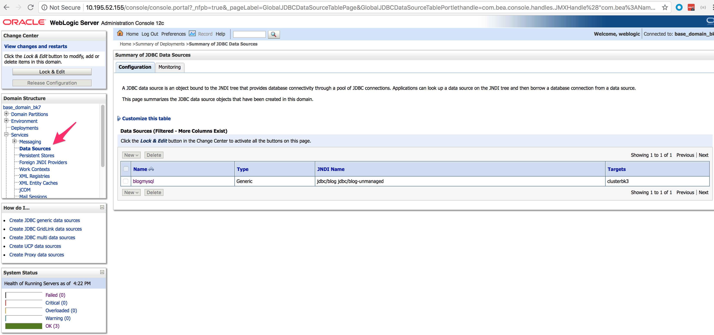
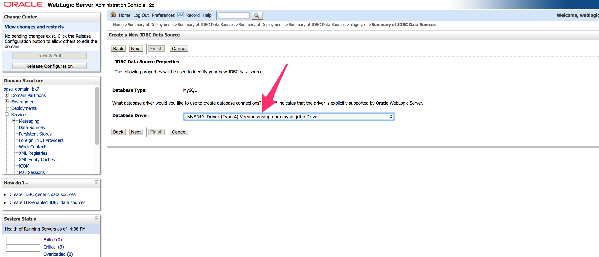
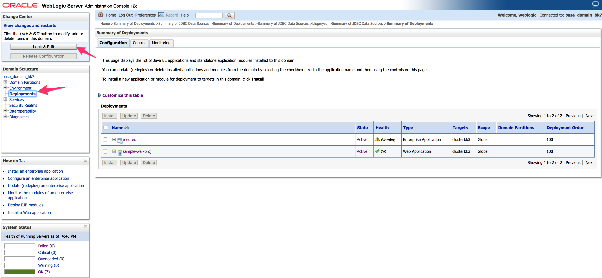
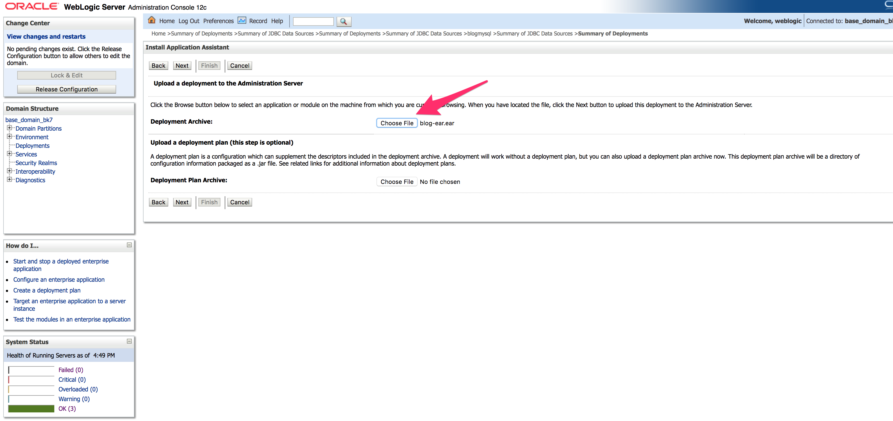
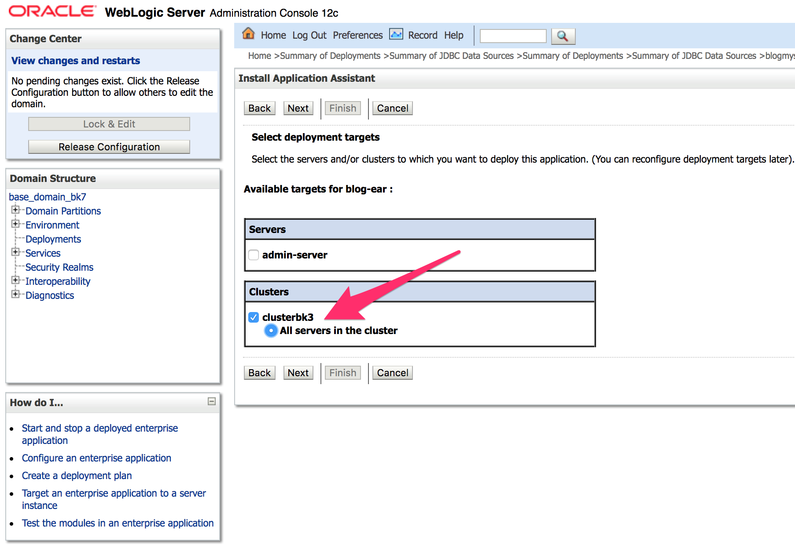
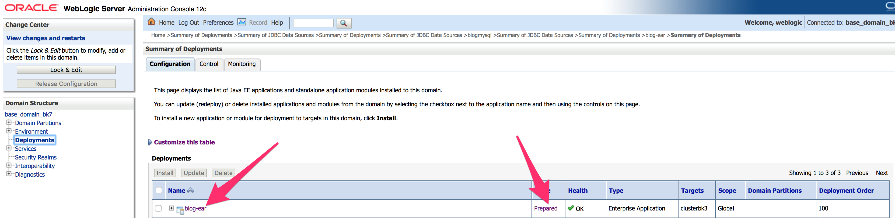
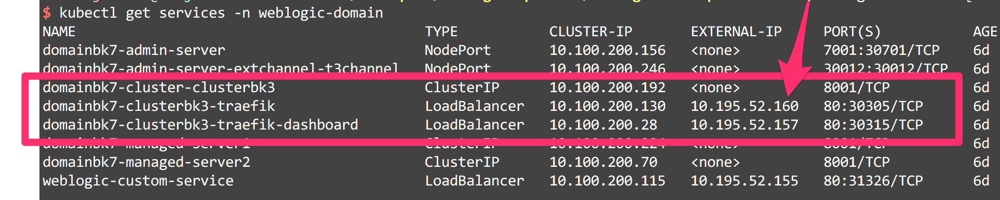

# Deploying a JEE app to Weblogic Domain

The purpose of this document is to go over the details of deploying a JEE application with a database dependency to
a Weblogic domain that has been created using these [steps](../02-create_weblogic_domain)

The application represents a simple Blog domain and provides REST interface for managing Users, posts, comments.

## Preparing the Application
### Clone a sample Application

The sample project is called `blog-ear-project` and it is available in the samples folder of [this repo](https://github.com/pivotal-cf/weblogic-k8s-operator-recipe)

### Build the project

Build the project using the following command:

```
cd samples/blog-ear-project
./mvnw clean package
```

The package to be deployed will get created in the blog-ear-project/blog-ear/target/blog-ear.ear file.

## Installing the Database

**If the environment is PKS**, ensure that `vsphere-storage` class is present in the environment, if not create one with the following yaml:

```
kind: StorageClass
apiVersion: storage.k8s.io/v1beta1
metadata:
  name: vsphere-storage
provisioner: kubernetes.io/vsphere-volume
parameters:
    diskformat: zeroedthick
```

This definition is also available in the `specs/data-services/vsphere` folder.

If the enviornment is not PKS, create the persistent volume for the database with an accessmode of `ReadWriteOnce`. Modify the `mysql-pv-sample.yml` file for the right values in the environment and create the persistent volume

```
cd spec/data-services
kubectl apply -f mysql-pv-sample.yml
```

[Helm Charts](https://helm.sh/) will be used for deploying the database.

`Helm` is a client side utility and `tiller` is the server side counterpart orchestrating a deploy

Follow the instructions [here](https://docs.helm.sh/using_helm) to install helm chart. PKS requires a service account for tiller, the backend component of Helm chart, for right permissions to access Kubernetes API, the instructions to setup this account is [here](https://docs.pivotal.io/runtimes/pks/1-1/configure-tiller-helm.html)


Once tiller is in place, run the following command to deploy mysql:

```
helm install --name blog-db -f mysql-values.yml stable/mysql
```

If it is a PKS environment, ensure that the storageClass is specified as `vsphere-storage` in mysql-values.yml file:

```
persistence:
  storageClass: "vsphere-storage"
```


## Test the database

A sample pod with ubuntu installed in it can be deployed the following way and used for testing the mysql database:

```
cd data-services
kubectl apply -f ubuntu-debug.yml
kubectl exec -i --tty ubuntu-debug /bin/bash

# Using the resulting bash prompt
apt update && apt install -y mysql-client
mysql -h blog-db-mysql -u bloguser -D blogdb --password=blogpassword

# At mysql prompt
show tables;
```

## Create a JNDI Datasource

Using the admin console of the installed Weblogic domain



Click on "New" -> "Generic Datasource" and fill in details along these lines:





Note that the database server is of the form blog-db-mysql.`namespace`.svc.cluster.local, say if the namespace where the database is deployed is `default` then the hostname is `blog-db-mysql.default.svc.cluster.local`


Test the datasource configuration


Activate the datasource on all nodes of the cluster


## Deploy the Application

On the Admin Console, click on Deployments



Click on "Lock And Edit" and "Install" to get the wizard pages for an App install.

Browse to the generated ear file from the previous step:



Select defaults and target all servers in the cluster:



Continue to select the defaults, once all steps are completed, click on "Activate Changes" to complete the deployment.




If everything has worked upto this point, the application should appear in a "Prepared" state.

Move to the "Control" and start the app:


## Test the application

Using the following command, get the ip of the load balancer on top of the management servers:

```
kubectl get services -n weblogic-domain
```



In the image above, the ip is `10.195.52.160`

Using CURL, try the following endpoint:

```
curl -XGET 'http://10.195.52.160/blog-root/resources/api/post/list'
```

If everything is working, a json output shoud show up at this point.
